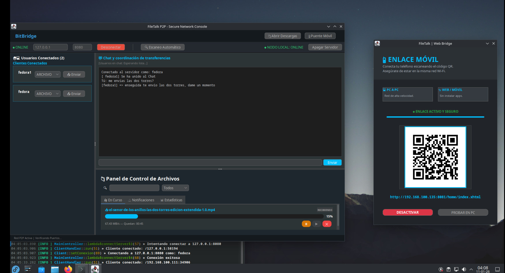

# 🌉 BitBridge
### **Mueve archivos entre tus computadoras a la velocidad de la luz.**

**Deja de ser rehén de nubes lentas, límites de gigabytes y memorias USB que siempre se pierden cuando más las necesitas.**

**BitBridge** revoluciona la forma en que mueves archivos en tu hogar u oficina, eliminando por completo la espera innecesaria. Mientras otros servicios obligan a tus datos a dar la vuelta al mundo para llegar a la habitación de al lado, BitBridge construye una **autopista privada y directa** entre tus dispositivos. Es simple: abre la app, arrastra tus archivos y deja que BitBridge exprima el 100% de la potencia de tu red para una transferencia instantánea, sin límites y totalmente segura.

  

---

## 🎯 ¿Por qué BitBridge es para ti?
Enviar un archivo a la PC que tienes al lado no debería depender de un servidor en otro continente. **BitBridge resuelve los problemas de las soluciones tradicionales:**

| Si usas... | El problema es... | Con **BitBridge** 🌉 |
| :--- | :--- | :--- |
| **La Nube (Drive/Dropbox)** | Es lento, depende de tu internet y tiene límites de espacio. | **Vuela a la velocidad de tu red local y sin límites de GB.** |
| **USB / Pendrives** | Tienes que conectarlo, copiar, desconectar y volver a conectar. | **Envía con dos clics, sin moverte de tu silla.** |
| **Cables** | Son estorbosos y limitan tu movilidad. | **Funciona por Wi-Fi o cable con la misma facilidad.** |

---

## ✨ Una Experiencia Diseñada para la Simplicidad

* **🚀 Velocidad de Vértigo:** ¿Tienes una película 4K o un instalador pesado? BitBridge exprime cada bit de tu tarjeta de red para que la espera sea mínima.
* **🔍 Aparece como por Arte de Magia:** Olvídate de configurar direcciones IP o números raros. Abre la app en dos equipos y se verán entre ellos al instante.
* **🛡️ Tu Privacidad es sagrada:** Tus archivos nunca salen de tu hogar u oficina. Al ser una conexión directa (P2P), nadie en internet puede ver lo que envías.
* **💎 Sin Archivos Corruptos:** BitBridge revisa que cada archivo llegue exactamente igual al original. Si dice "completado", es porque llegó perfecto.
* **📊 Control en Tiempo Real:** Un panel claro que te dice a qué velocidad vas y cuánto falta exactamente. Sin engaños.

---

## 📖 ¿Cuándo lo vas a necesitar?

* **💻 Entre dos PCs propias:** Pasa tus proyectos de trabajo de la laptop a la desktop al instante.
* **🎬 Noche de Películas:** Envía ese video pesado de 50GB a tu Media Center en cuestión de minutos.
* **🎮 Gaming:** Comparte instaladores de juegos pesados con tus amigos en una LAN party sin usar internet.
* **🏢 En la Oficina:** Comparte documentos confidenciales con colegas sin que pasen por servidores externos.
* **💻 Trabajo Imparable:** Mueve tus proyectos pesados de diseño o código entre tus equipos sin depender de un internet lento.
---

## 🏁 Guía Rápida: De 0 a 100 en un minuto

### 1. ¡Instálalo ya!
* **Windows:** Descarga el instalador `.exe` desde [Releases](https://github.com/albrinBuzz/bitBridge/releases).
* **Linux:** Usa el paquete RPM que encontrarás en la carpeta `/rpm`.

### 2. Conecta tus equipos
Abre BitBridge en las dos computadoras (asegúrate de que compartan el mismo Wi-Fi o red de cable).

### 3. ¡Envía y disfruta!
1. Selecciona tu archivo en la PC de origen.
2. Elige el nombre de la otra PC en la lista.
3. ¡Listo! Observa cómo la barra de progreso vuela.

---

## 🛠️ Para los curiosos (Tecnología)
Aunque por fuera es simple, por dentro BitBridge es una bestia tecnológica:
* **Java 21:** Máximo rendimiento con bajo consumo de memoria.
* **Zero-Copy:** Mueve datos del disco a la red sin desperdiciar ciclos del procesador.
* **Seguridad:** Verificación SHA-256 para cada transferencia.

---

## ❓ Preguntas Frecuentes

**¿Funciona si se cae mi Internet?**
¡Sí! BitBridge solo necesita tu router local. No gasta tus datos móviles ni depende de tu proveedor de internet.

**¿Puedo usarlo entre Windows y Linux?**
Totalmente. BitBridge es bilingüe y permite pasar archivos entre distintos sistemas operativos sin errores.

**¿Necesito cables especiales?**
Para nada. Funciona con el Wi-Fi o cable que ya tienes en casa.

**¿Mis archivos están seguros?**
Más que en cualquier otro lado. La transferencia es directa de PC a PC (P2P). Nada se guarda en internet.

---
> **"BitBridge: Porque mover archivos en tu casa no debería depender de internet."**